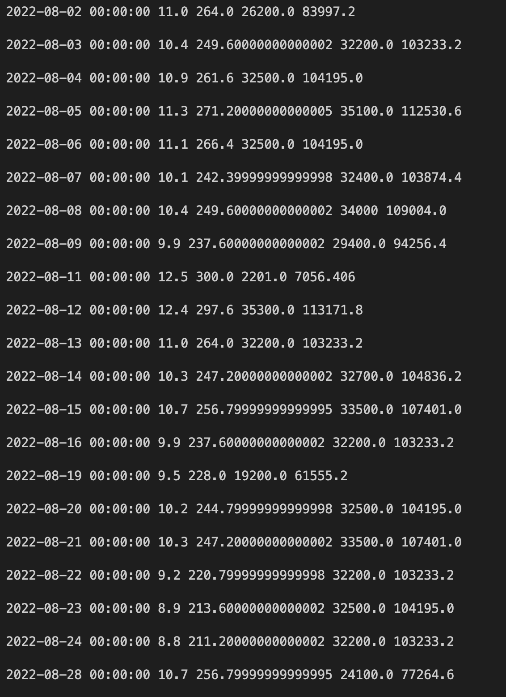
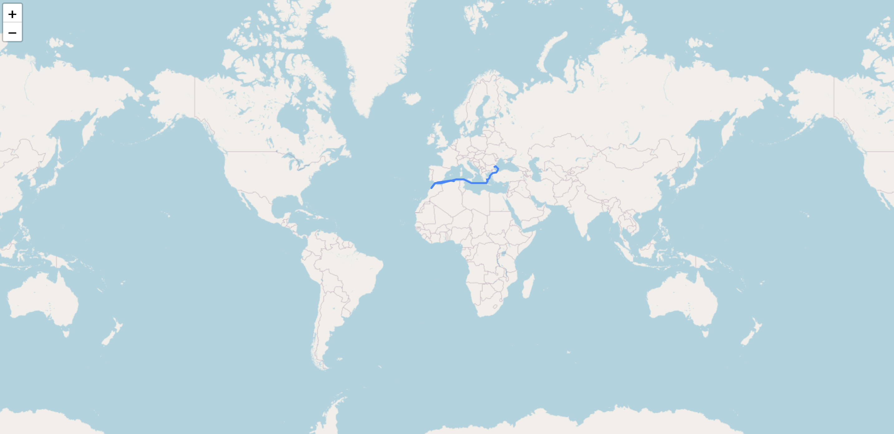

# Mercuria Hackathon 2022
Helping to accelerate the energy transition and reduce the carbon emissions of the maritime industry\
https://hackathon22mercuria.com/

## Background
Around 90% of world trade is transported by sea and carbon emissions from shipping are increasing.\
In 2013, the Commission set out a strategy towards reducing GHG emissions from the shipping industry. The strategy consists of 3 consecutive steps starting with monitoring, reporting and verification of CO2 emissions from large ships using EU ports.\
Ships can use Just In Time (JIT) arrival to optimise voyage speed and arrive in port when berth / nautical services are available. Avoiding travelling unnecessarily fast and then waiting outside port can reduce fuel consumption and carbon dioxide emissions by 14% on a per voyage basis.

## Challenge Details

### Challenge 1: Monitoring, reporting and verification of CO2 emissions
```
• Wouldn’t it be helpful if we could better track and verify shipping journeys and categorise the worst polluters?
Step 1: AIS monitoring
Using AIS data, track a vessel over a voyage and report on:
- Distance travelled
- Velocity
- Bunkers consumed
- GHG emissions
Step 2: Reporting
Each day, the vessel crew will provide a Noon Report to the Operator who is managing their voyage.
Create a process for vessel activity report data to be uploaded to your application.
Create a process for your application to automatically submit vessel activity reports.
Step 3: Verification
Compare manual reports with automated reports from Step 2.
Create a verification method for the data manually provided with the ability to highlight incorrect reporting.
Step 4: Analyse
For the data provided, across all time, rank the top 100 most polluting vessels along with the GHGs they emitted.
```

### Challenge 2: Voyage route optimization
```
• How can we help vessels to plan optimised routes that reduce fuel consumption and emissions in any scenario?
Step 1: Simple routing
Using a theoretical voyage between the ports provided, estimate:
- Distance to travel
- Time required for voyage
- Bunkers consumed
- GHG emissions produced
Step 2: Advanced routing
Building on Step 1, build an application which proposes multiple voyage routes and the estimated GHG emissions for all vessel types.
Your proposed voyages should be significantly different from each other, and be careful not to run your ship aground!
Output your voyage in GeoJSON.
Step 3: Intelligent routing
Your vessel has to arrive at its destination on a due date. How does this effect your GHG emissions?
What other factors can your model consider, and how can you use those to reduce GHG emissions?
Step 4: Analyse
Using the Voyage data, generate GHG efficient voyages for 100 unique voyages.
```

### Challenge 3: Cargo logistics optimization
```
• Vessel operators and cargo exporters want to optimise their logistics planning to minimize their impact on the environment. There should be an app for that!
Step 1: Cargo emissions
Looking at the AIS data provided, track a cargo ship on a voyage.
- How much cargo can this vessel carry? How much do you think is on board at the time you are observing it?
- How many tonnes of GHG is this vessel emitting per tonne of cargo?
Step 2: Vessel logistics
Create an application which allows vessel owners to register their planned voyages and the cargo capacity they have available.
The total voyage emissions should be shown, as well as emissions per tonne of cargo.
Step 3: Cargo logistics
Building on your application created in Step 2, allow exporters to register cargo they need to ship, including size, weight, destination, and due date.
Step 4: Logistics optimisation
Using the data gathered in Step 2 and 3, create matches between vessel voyages and cargo export needs.
How much can your application reduce GHG emissions per tonne of cargo?
You can ignore drag, or not!
```
## Structure
```
json_FilterDemo1/
[]_imo
T:Tanker
BC:Bolk Carriers
```
